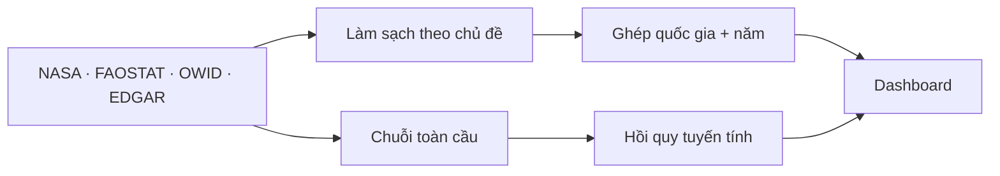

# Climate Lab

Dashboard khám phá dữ liệu khí hậu và mô phỏng xu hướng nhiệt độ toàn cầu. Đồ án môn **Tương tác dữ liệu trực quan** của **Nhóm 18 · HCMUTE**.

Hệ thống kết hợp dữ liệu nhiệt độ, lượng CO₂ và năng lượng tái tạo để trả lời ba câu hỏi: khí hậu đã thay đổi thế nào, sự khác biệt giữa các quốc gia ra sao, và xu hướng nhiệt độ có thể thay đổi thế nào dưới những giả định về lượng CO₂ trong tương lai.

## Chạy dự án

Khuyến nghị **Python 3.12** để đồng bộ với bản deploy; môi trường local Python 3.11 vẫn dùng được. Từ thư mục gốc:

```bash
python -m venv .venv
source .venv/bin/activate
pip install -r requirements.txt
python app.py
```

Mở **http://127.0.0.1:8050**. Trên Windows, dùng `.venv\Scripts\activate` để kích hoạt môi trường. Có thể đổi cổng qua biến môi trường `PORT`. Dữ liệu đã làm sạch và kết quả mô hình được lưu sẵn; không cần chạy lại pipeline để xem dashboard.

## Triển khai trên Vercel

1. Trong Vercel, chọn **Add New → Project**, import repository `climate-lab` từ GitHub.
2. Chọn nhánh `main`, giữ **Root Directory** ở thư mục gốc và **Framework Preset: Flask**.
3. Giữ mặc định các lệnh build/install và thư mục đầu ra, chọn **Deploy**. Không cần nhập biến môi trường hay khóa API.

`vercel.json` đặt máy chủ tại Singapore và loại dữ liệu gốc, SQLite, notebook, tài liệu, kiểm thử khỏi gói chạy; các file này vẫn được giữ trong repo. Bản Vercel tải thư viện Dash/Plotly từ CDN để tránh giới hạn kích thước phản hồi; bản local vẫn dùng tài nguyên cục bộ. Những lần push lên `main` sau đó sẽ tự triển khai lại khi đã kết nối GitHub.

## Khám phá dashboard

| Trang | Nội dung chính |
| --- | --- |
| **Tổng quan** | Các chỉ số và biểu đồ chính trong một màn hình. |
| **Bản đồ khí hậu** | Xem nhiệt độ hoặc CO₂ theo quốc gia; chuyển giữa địa cầu và bản đồ phẳng, chọn năm và quốc gia. |
| **Nhiệt độ** | Biểu đồ phân tích xu hướng theo thời gian và khu vực. |
| **Khí thải CO₂** | Xu hướng, xếp hạng quốc gia, cơ cấu ngành và mối liên hệ với năng lượng tái tạo. |
| **Mô hình dự đoán** | So sánh các giả định về lượng CO₂ và đường nhiệt độ đến năm 2050. |
| **Nhận định** | Những điểm đáng chú ý được tính theo phạm vi dữ liệu đang xem. |
| **Dữ liệu** | Xem bảng và tải CSV theo bộ lọc. |

Bộ lọc **thập kỷ**, châu lục và quốc gia dùng chung cho các trang dữ liệu. Chọn toàn bộ **1970–2024** hoặc một trong sáu nhóm **1970–1979, 1980–1989, 1990–1999, 2000–2009, 2010–2019, 2020–2024**. Nhóm cuối mới có 5 năm. Nhiệt độ và CO₂ mỗi tab có **6 biểu đồ tương tác**, bố trí hai biểu đồ mỗi hàng và có nút mở rộng; tất cả cùng áp dụng bộ lọc. Bản đồ dùng **trung bình các năm có số liệu của mỗi quốc gia trong từng thập kỷ**, tooltip ghi số năm có dữ liệu. Khi chọn nhiều thập kỷ, bản đồ tự chuyển mỗi 1,5 giây; bấm **Dừng** hoặc kéo thanh thập kỷ để xem một giai đoạn. Các đường xu hướng giữ chi tiết từng năm để xem biến động trong thập kỷ.

Xếp hạng CO₂ dùng **phát thải trung bình năm trong kỳ**, cơ cấu ngành dùng tỷ trọng từ CO₂ trung bình năm theo ngành. Biểu đồ CO₂/người và tái tạo lấy trung bình trên **cùng các năm có đủ hai chỉ số của từng quốc gia**; tái tạo có từ 1990 nên các thập kỷ trước đó hiển thị thiếu dữ liệu. Không thay giá trị thiếu bằng 0 và không lấy riêng năm cuối làm đại diện thập kỷ. Hình EDA gốc nằm trong mục thu gọn riêng, không áp dụng bộ lọc. Mô hình dự đoán sử dụng dữ liệu toàn cầu và bộ chọn kịch bản riêng.

Riêng trang **Nhiệt độ** đọc trực tiếp ba CSV đã xử lý trong `data/du_lieu_da_xu_ly/duc/`: NASA toàn cầu **1880–2025**, FAOSTAT quốc gia **1961–2025** và dữ liệu tháng tương ứng. Bộ lọc thập kỷ mở từ **1880–1889** đến **2020–2025** (nhóm cuối có 6 năm). Trước 1961, biểu đồ toàn cầu và tháng vẫn có số liệu; bản đồ, heatmap và phân bố quốc gia ghi thiếu dữ liệu. CSV tải từ trang Nhiệt độ dùng đúng nguồn và giai đoạn đang xem. Năm 2026 chưa đủ 12 tháng nên script của Đức đã loại khỏi CSV sạch.

## Dữ liệu và phương pháp

Dữ liệu được làm sạch theo từng chủ đề rồi ghép bằng khóa **mã quốc gia ISO3 + năm**. Bảng dùng cho dashboard bao phủ **1970–2024**, gồm **13.296 dòng và 244 mã quốc gia/vùng lãnh thổ**; không có khóa trùng theo [báo cáo ghép dữ liệu](data/du_lieu_da_xu_ly/nguyen_khang/bao_cao_ghep_du_lieu.json). Giá trị thiếu được giữ nguyên, không tự thay bằng 0.

Dữ liệu sạch còn được tổ chức trong [cơ sở dữ liệu SQLite](data/du_lieu_da_xu_ly/nguyen_khang/climate_lab.db), gồm **8 bảng có khóa chính, khóa ngoại và 2 view kết nối dữ liệu**. Xem [sơ đồ ERD và câu lệnh JOIN](tai_lieu/dung_chung/SO_DO_DU_LIEU.md).

| Chủ đề | Nguồn | Cách sử dụng |
| --- | --- | --- |
| Nhiệt độ toàn cầu | [NASA GISTEMP v4](https://data.giss.nasa.gov/gistemp/) | Độ lệch nhiệt độ so với trung bình 1951–1980. |
| Nhiệt độ theo quốc gia | [FAOSTAT](https://www.fao.org/faostat/en/#data/ET) | So sánh theo quốc gia, khu vực và thời gian. |
| CO₂, dân số | [Our World in Data / Global Carbon Project](https://github.com/owid/co2-data) | Tổng lượng CO₂ và CO₂ bình quân đầu người. |
| CO₂ theo ngành | [EDGAR](https://edgar.jrc.ec.europa.eu/report_2026) | Chỉ lấy **CO₂**, không trộn với tổng khí nhà kính quy đổi CO₂. |
| Năng lượng tái tạo | [UNSD, IEA, IRENA qua OWID](https://ourworldindata.org/grapher/share-of-final-energy-consumption-from-renewable-sources) | Đối chiếu với CO₂ bình quân; độ phủ giữa các nước không đồng đều. |

Chi tiết về tệp gốc, đơn vị và cột dữ liệu nằm trong [tài liệu nguồn dữ liệu](tai_lieu/dung_chung/NGUON_DU_LIEU.md). Các chuỗi có phạm vi năm khác nhau: **1970–2024 là khoảng phân tích chung của bảng ghép và mô hình**, không phải khoảng đầy đủ của mọi nguồn. Trang Nhiệt độ dùng toàn bộ phạm vi CSV của Đức như mô tả ở trên.



### Mô hình dự đoán

Mô hình **hồi quy tuyến tính** liên hệ lượng CO₂ tích lũy toàn cầu với độ lệch nhiệt độ trung bình trượt 5 năm. Dữ liệu **1974–2014** dùng để huấn luyện, **2015–2024** để kiểm tra theo thời gian; sau đó mô hình được huấn luyện lại trên **1974–2024** để tạo kịch bản **2025–2050**. Kết quả kiểm tra lưu trong [thông số mô hình](data/ket_qua_mo_hinh/nguyen_khang/thong_tin_mo_hinh.json): **R² = 0,835**, **MAE = 0,031 °C**.

Dashboard cho phép so sánh mức CO₂ tiếp diễn xu hướng, giữ nguyên, giảm 5% mỗi năm hoặc tốc độ do người dùng chọn. Đây là **mô phỏng thống kê theo giả định**, không phải dự báo khí hậu chính thức. Dải 90% trên biểu đồ chỉ phản ánh bất định của mô hình hồi quy theo các giả định thống kê, chưa bao gồm bất định của kịch bản hay toàn bộ yếu tố vật lý khí hậu. Xem [giải thích mô hình](mo_hinh_du_doan/nguyen_khang/GIAI_THICH.md).

## Cấu trúc dự án

```text
app.py                         Điểm chạy dashboard
data/                          Dữ liệu gốc, dữ liệu đã xử lý và kết quả mô hình
bang_dieu_khien/nguyen_khang/  Giao diện, biểu đồ, dữ liệu và kiểm thử
phan_tich_nhiet_do/duc/        Làm sạch, phân tích và biểu đồ nhiệt độ
phan_tich_co2/quan/            Làm sạch, phân tích và biểu đồ CO₂
mo_hinh_du_doan/nguyen_khang/  Ghép dữ liệu, hồi quy và kịch bản
tai_lieu/dung_chung/           Nguồn dữ liệu và tài liệu dùng chung
```

Mã nguồn được chia theo nhiệm vụ và thành viên; toàn bộ tệp dữ liệu nằm tập trung trong [`data/`](data/README.md). Phần nhận định chi tiết nằm ở [nhiệt độ](phan_tich_nhiet_do/duc/NHAN_DINH.md) và [CO₂](phan_tich_co2/quan/NHAN_DINH.md).

## Tái tạo kết quả và kiểm thử

`requirements.txt` chỉ chứa thư viện chạy dashboard. Để làm sạch dữ liệu, train model, tạo biểu đồ tĩnh và chạy kiểm thử, cài thêm thư viện trong `requirements-dev.txt`, rồi chạy pipeline theo thứ tự:

```bash
pip install -r requirements-dev.txt
python phan_tich_nhiet_do/duc/lam_sach_du_lieu.py
python phan_tich_co2/quan/lam_sach_du_lieu.py
python mo_hinh_du_doan/nguyen_khang/ghep_du_lieu.py
python mo_hinh_du_doan/nguyen_khang/tao_co_so_du_lieu.py
python mo_hinh_du_doan/nguyen_khang/mo_hinh_nhiet_do.py
```

Chạy kiểm thử tự động:

```bash
python -m unittest discover -s bang_dieu_khien/nguyen_khang/kiem_thu -v
```

Mở notebook bằng tiện ích Jupyter trong VS Code, chọn **Select Kernel → Python Environments → `.venv`** sau khi cài `requirements-dev.txt`.

Kiểm thử giao diện: giữ `python app.py` đang chạy, mở terminal khác đã kích hoạt `.venv`, rồi chạy:

```bash
python -m playwright install chromium
python bang_dieu_khien/nguyen_khang/kiem_thu/browser_smoke.py
```

Cài trình duyệt một lần trên mỗi máy. Có thể dùng Chrome đã cài bằng biến môi trường `BROWSER_CHANNEL=chrome` thay cho tải Chromium. Nếu app đổi cổng, đặt `BASE_URL` theo địa chỉ app trước khi chạy kiểm thử.

Các trang phân tích còn có tệp biểu đồ tĩnh và tương tác trong thư mục `bieu_do/` của từng thành viên. Dữ liệu đầu ra và thông số mô hình được lưu trong dự án để đối chiếu với dashboard.

## Nhóm thực hiện

| Thành viên | Phụ trách |
| --- | --- |
| Huỳnh Cao Trung Đức | Dữ liệu và phân tích nhiệt độ |
| Quân | Dữ liệu và phân tích CO₂ |
| Nguyên Khang | Ghép dữ liệu, mô hình dự đoán và dashboard |
