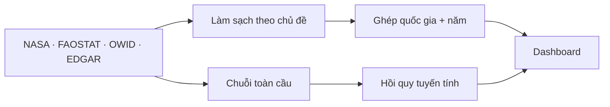

# Climate Lab

Dashboard khám phá dữ liệu khí hậu và mô phỏng xu hướng nhiệt độ toàn cầu. Đồ án môn **Tương tác dữ liệu trực quan** của **Nhóm 18 · HCMUTE**.

Hệ thống kết hợp dữ liệu nhiệt độ, lượng CO₂ và năng lượng tái tạo để trả lời ba câu hỏi: khí hậu đã thay đổi thế nào, sự khác biệt giữa các quốc gia ra sao, và xu hướng nhiệt độ có thể thay đổi thế nào dưới những giả định về lượng CO₂ trong tương lai.

## Chạy dự án

Khuyến nghị **Python 3.12** để đồng bộ với bản deploy; môi trường local Python 3.11 vẫn dùng được. Từ thư mục gốc:

```bash
python -m venv .venv
source .venv/bin/activate
pip install -r requirements.txt
python app.py
```

Mở **http://127.0.0.1:8050**. Trên Windows, dùng `.venv\Scripts\activate` để kích hoạt môi trường. Có thể đổi cổng qua biến môi trường `PORT`. Dữ liệu đã làm sạch và kết quả mô hình được lưu sẵn; không cần chạy lại pipeline để xem dashboard.

## Triển khai trên Vercel

1. Trong Vercel, chọn **Add New → Project**, import repository `climate-lab` từ GitHub.
2. Chọn nhánh `main`, giữ **Root Directory** ở thư mục gốc và **Framework Preset: Flask**.
3. Giữ mặc định các lệnh build/install và thư mục đầu ra, chọn **Deploy**. Không cần nhập biến môi trường hay khóa API.

`vercel.json` đặt máy chủ tại Singapore và loại dữ liệu gốc, SQLite, notebook, tài liệu, kiểm thử khỏi gói chạy; các file này vẫn được giữ trong repo. Bản Vercel tải thư viện Dash/Plotly từ CDN để tránh giới hạn kích thước phản hồi; bản local vẫn dùng tài nguyên cục bộ. Những lần push lên `main` sau đó sẽ tự triển khai lại khi đã kết nối GitHub.

## Khám phá dashboard

| Trang | Nội dung chính |
| --- | --- |
| **Tổng quan** | Các chỉ số và biểu đồ chính trong một màn hình. |
| **Bản đồ khí hậu** | Xem nhiệt độ hoặc CO₂ theo quốc gia; chuyển giữa địa cầu và bản đồ phẳng, chọn năm và quốc gia. |
| **Nhiệt độ** | Biểu đồ phân tích xu hướng theo thời gian và khu vực. |
| **Khí thải CO₂** | Xu hướng, xếp hạng quốc gia, cơ cấu ngành và mối liên hệ với năng lượng tái tạo. |
| **Mô hình dự đoán** | So sánh các giả định về lượng CO₂ và đường nhiệt độ đến năm 2050. |
| **Nhận định** | Những điểm đáng chú ý được tính theo phạm vi dữ liệu đang xem. |
| **Dữ liệu** | Xem bảng và tải CSV theo bộ lọc. |

Bộ lọc nhớ riêng **thập kỷ, châu lục, quốc gia và chỉ số bản đồ** của từng trang: Nhiệt độ **1961–2025**, CO₂ **1850–2024**, Tổng quan/Bản đồ/Nhận định/Dữ liệu **1961–2024**. Mô hình dùng lịch sử toàn cầu **1880–2024**, được chọn qua đánh giá theo thời gian, và có điều khiển kịch bản riêng. Nhiệt độ và CO₂ mỗi tab có **6 biểu đồ tương tác**, bố trí hai biểu đồ mỗi hàng và có nút mở rộng. Tổng quan dùng donut CO₂ theo châu lục; tab CO₂ dùng area chart theo châu lục. Bản đồ dùng trung bình từng thập kỷ, tooltip ghi số năm có dữ liệu; dùng nút **Phát/Dừng** hoặc thanh thập kỷ để đổi giai đoạn. Bấm quốc gia trên địa cầu hoặc bản đồ EDA cập nhật bộ lọc; khi bấm sang châu lục khác trên địa cầu, châu lục đổi theo quốc gia. Đổi khoảng năm đưa địa cầu về năm cuối của khoảng; góc nhìn vẫn được giữ.

Xếp hạng CO₂ dùng **phát thải trung bình năm trong kỳ**, cơ cấu ngành dùng tỷ trọng từ CO₂ trung bình năm theo ngành. Biểu đồ CO₂/người và tái tạo lấy trung bình trên **cùng các năm có đủ hai chỉ số của từng quốc gia**; tái tạo có từ 1990 nên các thập kỷ trước đó hiển thị thiếu dữ liệu. Không thay giá trị thiếu bằng 0 và không lấy riêng năm cuối làm đại diện thập kỷ. Hình EDA gốc nằm trong mục thu gọn riêng, không áp dụng bộ lọc. Mô hình dự đoán sử dụng dữ liệu toàn cầu và bộ chọn kịch bản riêng.

Trang **Nhiệt độ** đọc trực tiếp các CSV đã xử lý của Đức. Bộ lọc mở từ **1961–1969** (9 năm) đến **2020–2025** (6 năm), để chuỗi toàn cầu và quốc gia có cùng giai đoạn hiển thị. File NASA vẫn giữ **1880–2025** cho phân tích lịch sử và mô hình. CSV tải xuống dùng đúng nguồn và giai đoạn đang xem. Năm 2026 chưa đủ 12 tháng nên không đưa vào dữ liệu năm sạch.

## Dữ liệu và phương pháp

Dữ liệu ghép bằng khóa **mã quốc gia ISO3 + năm**. Bảng quốc gia giữ **1850–2024**, gồm **39.643 dòng và 244 mã quốc gia/vùng lãnh thổ**; không có khóa trùng theo [báo cáo ghép dữ liệu](data/du_lieu_da_xu_ly/nguyen_khang/bao_cao_ghep_du_lieu.json). Giá trị thiếu được giữ nguyên. Chuỗi toàn cầu NASA + OWID đủ **145 năm 1880–2024**; Tổng quan lấy **64 năm 1961–2024** có đủ hai chỉ số. Trong bảng quốc gia cùng giai đoạn, **11.520/15.456** dòng có cả nhiệt độ và CO₂; không coi mọi quốc gia đều đầy đủ. Trang CO₂ toàn cầu đọc riêng `quan/co2_toan_cau.csv` để giữ được 1850–1879.

`START_YEAR = 1850` giữ lịch sử CO₂ cho dashboard; phép ghép toàn cầu tự bắt đầu ở 1880 theo NASA. Chốt 2024 theo năm cuối có CO₂.
Nhiệt độ quốc gia trước 1961 giữ null, không thay bằng nhiệt độ toàn cầu.
Bảng ghép và SQLite dùng **`duc/nhiet_do_quoc_gia_nam_lich.csv`**:
trung bình tháng 1–12, chỉ tính khi đủ 12 giá trị. Bảng FAOSTAT năm khí tượng
`nhiet_do_quoc_gia.csv` vẫn giữ nguyên giá trị nguồn (tháng 12 năm trước đến tháng 11)
và được dùng trên trang Nhiệt độ. Hai bảng có thể khác giá trị do khác cửa sổ 12 tháng.

EDGAR chuẩn hóa mã Curaçao từ `ANT` sang `CUW`, giữ mã nguồn trong `source_iso_alpha`.
`SCG` là chuỗi Serbia và Montenegro gộp chung: tính khi xem tổng/toàn châu Âu,
không gán cho từng nước. Biểu đồ ngành ghi rõ tỷ trọng trong các ngành có số liệu;
`sectors_available` và `sectors_expected` chỉ ra nhóm thiếu dữ liệu. Biểu đồ tái tạo
hiển thị độ phủ theo năm và chỉ lấy các năm có đủ cặp chỉ số cho mỗi quốc gia.

Dữ liệu sạch còn được tổ chức trong [cơ sở dữ liệu SQLite](data/du_lieu_da_xu_ly/nguyen_khang/climate_lab.db), gồm **8 bảng có khóa chính, khóa ngoại và 2 view kết nối dữ liệu**. Xem [sơ đồ ERD và câu lệnh JOIN](tai_lieu/dung_chung/SO_DO_DU_LIEU.md).

| Chủ đề | Nguồn | Cách sử dụng |
| --- | --- | --- |
| Nhiệt độ toàn cầu | [NASA GISTEMP v4](https://data.giss.nasa.gov/gistemp/) | Độ lệch nhiệt độ so với trung bình 1951–1980. |
| Nhiệt độ theo quốc gia | [FAOSTAT](https://www.fao.org/faostat/en/#data/ET) | So sánh theo quốc gia, khu vực và thời gian. |
| CO₂, dân số | [Our World in Data / Global Carbon Project](https://github.com/owid/co2-data) | Tổng lượng CO₂ và CO₂ bình quân đầu người. |
| CO₂ theo ngành | [EDGAR](https://edgar.jrc.ec.europa.eu/report_2026) | Chỉ lấy **CO₂**, không trộn với tổng khí nhà kính quy đổi CO₂. |
| Năng lượng tái tạo | [UNSD, IEA, IRENA qua OWID](https://ourworldindata.org/grapher/share-of-final-energy-consumption-from-renewable-sources) | Đối chiếu với CO₂ bình quân; độ phủ giữa các nước không đồng đều. |

Chi tiết nguồn, đơn vị và cột nằm trong [tài liệu nguồn dữ liệu](tai_lieu/dung_chung/NGUON_DU_LIEU.md). EDGAR chỉ có từ 1970, tái tạo từ 1990 và nhiệt độ quốc gia từ 1961; khi lọc CO₂ về trước các mốc này, biểu đồ phụ ghi thiếu dữ liệu, không tự dùng số liệu của năm khác.



### Mô hình dự đoán

Mô hình **hồi quy tuyến tính** liên hệ lượng CO₂ tích lũy toàn cầu với độ lệch nhiệt độ trung bình trượt 5 năm. Dữ liệu nguồn bắt đầu **1880**; trung bình đủ 5 năm bắt đầu **1884**. Dữ liệu **1884–2014** dùng để huấn luyện, **2015–2024** để kiểm tra theo thời gian; sau đó mô hình được huấn luyện lại trên **1884–2024** để tạo kịch bản **2025–2050**. Kết quả kiểm tra lưu trong [thông số mô hình](data/ket_qua_mo_hinh/nguyen_khang/thong_tin_mo_hinh.json): **R² = 0,823**, **MAE = 0,031 °C**.

So sánh ba mốc bắt đầu 1880, 1961, 1970 trên cùng bốn giai đoạn **1995–2014** chọn lịch sử 1880 (MAE **0,036°C**). Tập **2015–2024** dành cho đánh giá cuối, không dùng chọn lịch sử. Dashboard mô phỏng CO₂ tiếp diễn, giữ nguyên, giảm 5% hoặc mức tùy chỉnh. Mục tiêu là **nhiệt độ trung bình 5 năm**, không phải nhiệt độ từng năm. Dải phân vị 5%–95% dùng bootstrap theo khối; chưa gồm sai số nguồn, bất định phát thải hay toàn bộ yếu tố vật lý và không bảo đảm độ phủ tương lai 90%. Xem [giải thích và bảng so sánh mô hình](mo_hinh_du_doan/nguyen_khang/GIAI_THICH.md).

## Cấu trúc dự án

```text
app.py                         Điểm chạy dashboard
data/                          Dữ liệu gốc, dữ liệu đã xử lý và kết quả mô hình
bang_dieu_khien/nguyen_khang/  Giao diện, biểu đồ, dữ liệu và kiểm thử
phan_tich_nhiet_do/duc/        Làm sạch, phân tích và biểu đồ nhiệt độ
phan_tich_co2/quan/            Làm sạch, phân tích và biểu đồ CO₂
mo_hinh_du_doan/nguyen_khang/  Ghép dữ liệu, hồi quy và kịch bản
tai_lieu/dung_chung/           Nguồn dữ liệu và tài liệu dùng chung
```

Mã nguồn được chia theo nhiệm vụ và thành viên; toàn bộ tệp dữ liệu nằm tập trung trong [`data/`](data/README.md). Phần nhận định chi tiết nằm ở [nhiệt độ](phan_tich_nhiet_do/duc/NHAN_DINH.md) và [CO₂](phan_tich_co2/quan/NHAN_DINH.md).

## Tái tạo kết quả và kiểm thử

`requirements.txt` chỉ chứa thư viện chạy dashboard. Để làm sạch dữ liệu, train model, tạo biểu đồ tĩnh và chạy kiểm thử, cài thêm thư viện trong `requirements-dev.txt`, rồi chạy pipeline theo thứ tự:

```bash
pip install -r requirements-dev.txt
python phan_tich_nhiet_do/duc/lam_sach_du_lieu.py
python phan_tich_co2/quan/lam_sach_du_lieu.py
python mo_hinh_du_doan/nguyen_khang/ghep_du_lieu.py
python mo_hinh_du_doan/nguyen_khang/tao_co_so_du_lieu.py
python mo_hinh_du_doan/nguyen_khang/mo_hinh_nhiet_do.py
```

Chạy kiểm thử tự động:

```bash
python -m unittest discover -s bang_dieu_khien/nguyen_khang/kiem_thu -v
```

Mở notebook bằng tiện ích Jupyter trong VS Code, chọn **Select Kernel → Python Environments → `.venv`** sau khi cài `requirements-dev.txt`.

Kiểm thử giao diện: giữ `python app.py` đang chạy, mở terminal khác đã kích hoạt `.venv`, rồi chạy:

```bash
python -m playwright install chromium
python bang_dieu_khien/nguyen_khang/kiem_thu/browser_smoke.py
```

Cài trình duyệt một lần trên mỗi máy. Có thể dùng Chrome đã cài bằng biến môi trường `BROWSER_CHANNEL=chrome` thay cho tải Chromium. Nếu app đổi cổng, đặt `BASE_URL` theo địa chỉ app trước khi chạy kiểm thử.

Các trang phân tích còn có tệp biểu đồ tĩnh và tương tác trong thư mục `bieu_do/` của từng thành viên. Dữ liệu đầu ra và thông số mô hình được lưu trong dự án để đối chiếu với dashboard.

## Nhóm thực hiện

| Thành viên | Phụ trách |
| --- | --- |
| Huỳnh Cao Trung Đức | Dữ liệu và phân tích nhiệt độ |
| Quân | Dữ liệu và phân tích CO₂ |
| Nguyên Khang | Ghép dữ liệu, mô hình dự đoán và dashboard |
