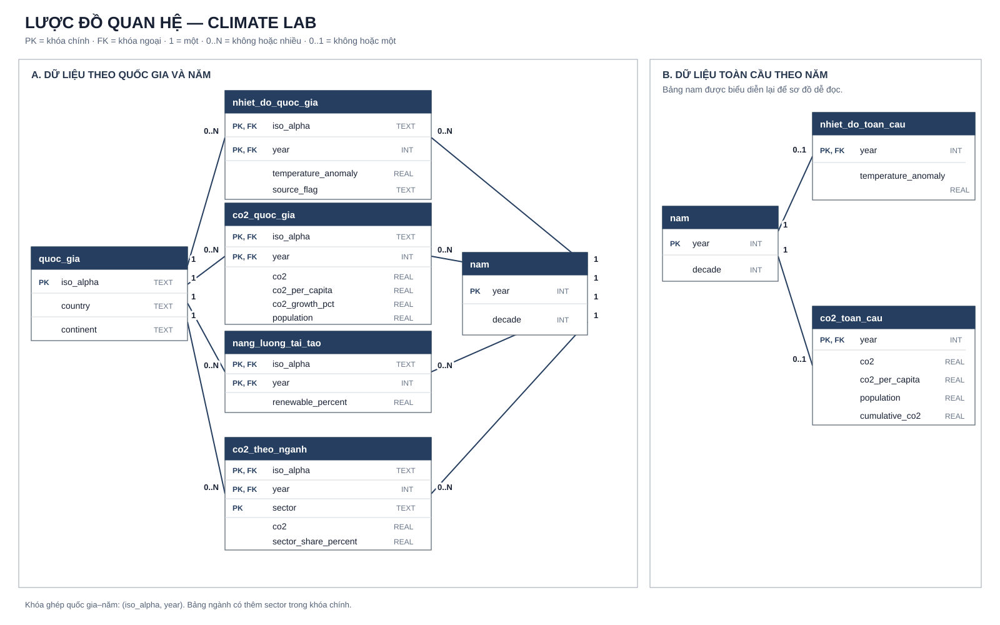

# Sơ đồ cơ sở dữ liệu

File [`climate_lab.db`](../../data/du_lieu_da_xu_ly/nguyen_khang/climate_lab.db) là cơ sở dữ liệu SQLite được tạo từ sáu bảng dữ liệu sạch. Hai bảng `quoc_gia` và `nam` lưu thông tin dùng chung, giúp tránh lặp lại tên quốc gia, châu lục và thập kỷ ở mọi bảng.

## Sơ đồ kết nối dữ liệu

[](SO_DO_ERD.svg)

Ký hiệu `PK` là khóa chính, `FK` là khóa ngoại. `1 — 0..N` nghĩa là một bản ghi danh mục có thể liên kết với không hoặc nhiều dòng dữ liệu. `1 — 0..1` nghĩa là mỗi năm có tối đa một dòng toàn cầu. Bảng `nam` được lặp lại ở hai cụm trên hình để đường nối không chồng chéo; trong cơ sở dữ liệu chỉ có một bảng `nam`.

## Các bảng và khóa nối

| Bảng | Số dòng | Khóa chính | Nội dung |
| --- | ---: | --- | --- |
| `quoc_gia` | 246 | `iso_alpha` | Tên quốc gia và châu lục |
| `nam` | 276 | `year` | Năm và thập kỷ |
| `nhiet_do_quoc_gia` | 14.263 | `iso_alpha, year` | Chênh lệch nhiệt độ theo quốc gia |
| `co2_quoc_gia` | 42.480 | `iso_alpha, year` | CO₂, CO₂/người và dân số |
| `nang_luong_tai_tao` | 7.673 | `iso_alpha, year` | Tỷ lệ năng lượng tái tạo |
| `co2_theo_nganh` | 82.040 | `iso_alpha, year, sector` | CO₂ theo quốc gia và ngành |
| `nhiet_do_toan_cau` | 146 | `year` | Nhiệt độ toàn cầu |
| `co2_toan_cau` | 275 | `year` | CO₂ toàn cầu |

Hai bảng danh mục giữ toàn bộ phạm vi của dữ liệu sạch, kể cả mã quốc gia lịch sử và các năm ngoài khoảng hiển thị. Vì vậy `quoc_gia` có 246 mã, còn dashboard sau khi giới hạn giai đoạn 1970–2024 có 244 mã.

Khóa `iso_alpha` là mã ISO3 nên ổn định hơn tên quốc gia. Khóa ghép `iso_alpha + year` bảo đảm mỗi quốc gia chỉ có một dòng trong một năm. Bảng ngành cần thêm `sector` vì một quốc gia có nhiều ngành trong cùng năm.

## Cách tạo bảng dùng cho dashboard

View `dashboard_quoc_gia_nam` lấy hợp các khóa quốc gia–năm của ba bảng chỉ tiêu, sau đó `LEFT JOIN` nhiệt độ, CO₂ và năng lượng tái tạo. Cách làm này giữ lại dữ liệu có ở bất kỳ nguồn nào, đồng thời giữ `NULL` khi nguồn còn thiếu số liệu.

```sql
SELECT q.country, t.year, t.temperature_anomaly,
       c.co2, c.co2_per_capita, r.renewable_percent
FROM nhiet_do_quoc_gia AS t
JOIN quoc_gia AS q USING (iso_alpha)
LEFT JOIN co2_quoc_gia AS c USING (iso_alpha, year)
LEFT JOIN nang_luong_tai_tao AS r USING (iso_alpha, year);
```

Không nối trực tiếp `co2_theo_nganh` vào bảng quốc gia–năm nếu chưa tổng hợp theo ngành, vì quan hệ một–nhiều sẽ làm lặp dữ liệu nhiệt độ và dân số.

## Tạo lại và xem ERD

```bash
python mo_hinh_du_doan/nguyen_khang/tao_co_so_du_lieu.py
```

Sơ đồ SVG phía trên hiển thị trực tiếp trong VS Code và GitHub. Muốn kiểm tra từ cơ sở dữ liệu thật, có thể mở `climate_lab.db` bằng DBeaver, chọn các bảng rồi dùng **View Diagram**.
